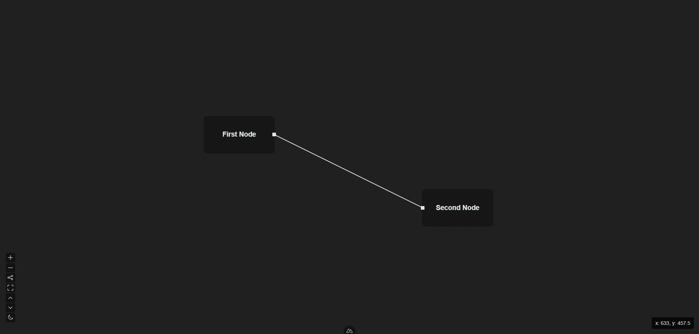

<h1 align="center">
    Project Imge
</h1>
<h3 align="center">
    Study project: Web based node editor / process visualization tool
</h3>
<!-- <p align="center">
    <a href="#">Docs</a> |
    <a href="#">Report an Issue</a> 
</p> -->

<p align="center">
    
    
    
    
</p>

<p align="center">


<figcaption>v0.22 Node and link display</figcaption>

</p>

# Installation and Use

### Prerequisites
1. Install [node.js](https://nodejs.org/en/download/package-manager)

### Install
1. Clone project
    ```
    git clone https://github.com/kutaycoskuner/imge.git
    ```
2. Navigate to project directory
    ```bash
    cd imge
    ```
3. Install npm packages
    ```
    npm install
    ```
### Run the program
1. Navigate to project directory
    ```bash
    cd imge
    ```
2. Run development server
    ```
    npm run dev
    ```

# Features
- [x] Import JSON Data
- [x] Display Nodes and Links
- [x] Color Mode
- [x] Infinite Canvas | Scale and Translation
- [x] Info panel 
- [x] Accessibility buttons: zoom, fit view

# Roadmap
- [ ] Accessibility buttons: Import / Export
- [ ] Export data
- [ ] Adding links on ui