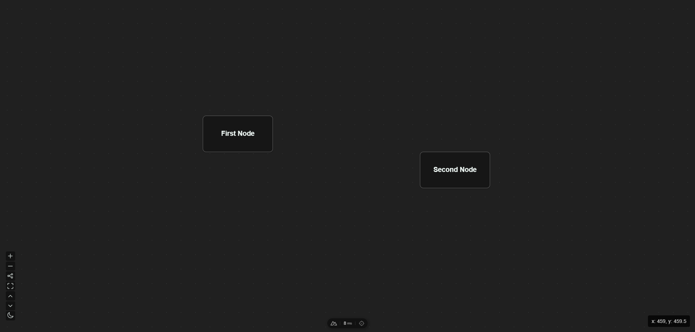

<h1 align="center">
    Project Imge
</h1>
<h3 align="center">
    Web based node editor
</h3>
<!-- 

    <a href="#">Docs</a> |
    <a href="#">Report an Issue</a> 

 -->

    
    
    
    

<figcaption>v0.21 First Node</figcaption>

